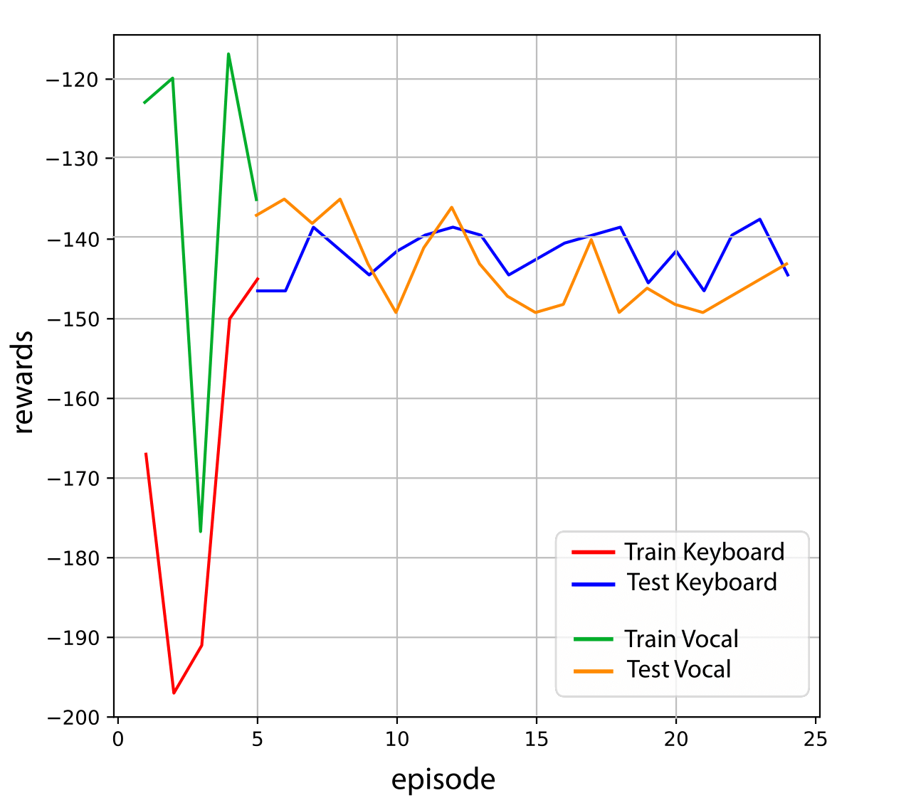
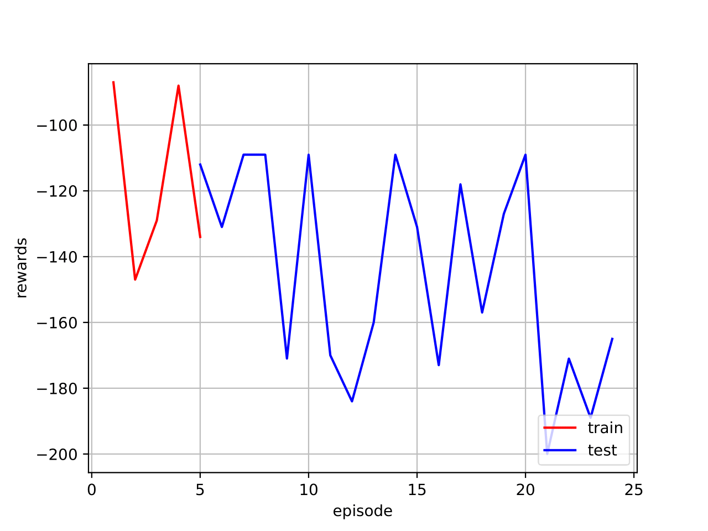
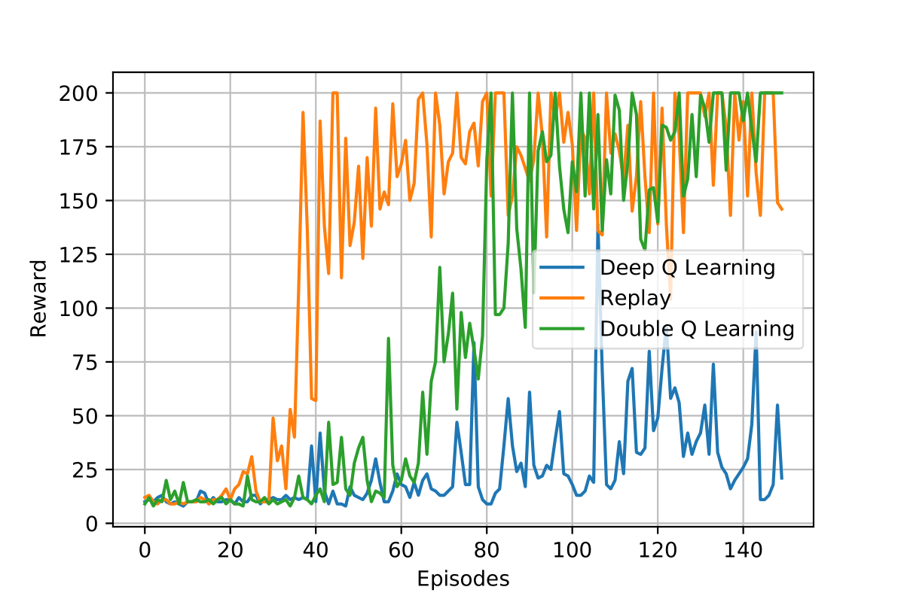
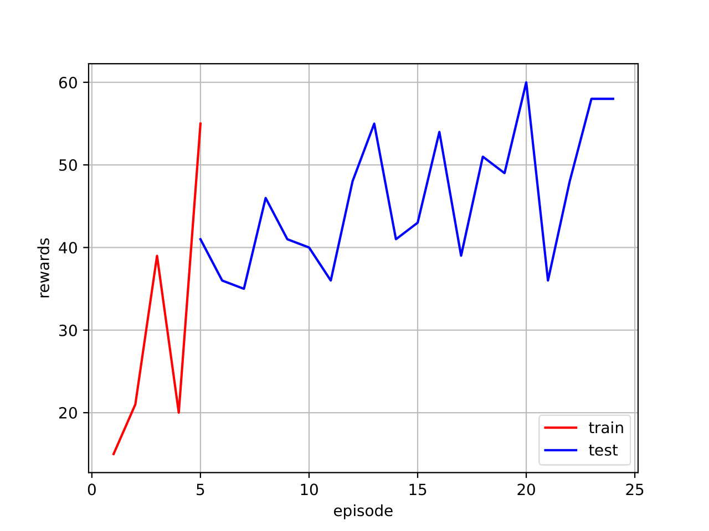

[![Badge License]][license]

<div align = center>

# Mini Project - Learning from Human Feedback

_Assistant Professor: Silvia Tulli_ <br>
_Course of Social Robotics Coordinated by Mohamed Chetouani_

<br>

## Team

[![Badge Marco]][marco] 
[![Badge Andrea]][andrea]
[![Badge Sofia]][sofia]
[![Badge Federico]][federico]

<br>

## Table of Contents

<div align = left>

- [Mini Project - Learning from Human Feedback](#mini-project---learning-from-human-feedback)
  - [Team](#team)
  - [Table of Contents](#table-of-contents)
- [1. Minigrid](#1-minigrid)
  - [1.1 Reinforcement Learning: MiniGrid with Policy Gradient](#11-reinforcement-learning-minigrid-with-policy-gradient)
    - [1.1.1 Run the project](#111-run-the-project)
    - [1.1.2 Results and code link](#112-results-and-code-link)
  - [1.2 Inverse Reinforcement Learning on Minigrid](#12-inverse-reinforcement-learning-on-minigrid)
    - [1.2.1 Run the project](#121-run-the-project)
    - [1.2.2 Results and code link](#122-results-and-code-link)
- [2. Mountain Car](#2-mountain-car)
  - [2.1 Mountain Car using Q-learning](#21-mountain-car-using-q-learning)
    - [2.2.1 Run the project](#221-run-the-project)
    - [2.2.2 Results and code link](#222-results-and-code-link)
  - [2.2 Mountain Car with Tamer](#22-mountain-car-with-tamer)
    - [2.2.1 Run the project](#221-run-the-project-1)
    - [2.2.2 Results and code link](#222-results-and-code-link-1)
- [3. Cartpole](#3-cartpole)
  - [3.1 Cartpole with Reinforcement Learning DQN](#31-cartpole-with-reinforcement-learning-dqn)
    - [3.1.1 Run the project](#311-run-the-project)
    - [3.1.2 Results and Code link](#312-results-and-code-link)
  - [3.2 Cartpole with Human in the loop Evaluative Feedback](#32-cartpole-with-human-in-the-loop-evaluative-feedback)
    - [3.2.1 Run the project](#321-run-the-project)
    - [3.2.2 Results and Code link](#322-results-and-code-link)
  - [3.3 Cartpole with Inverse Reinforcement learning](#33-cartpole-with-inverse-reinforcement-learning)
    - [3.3.1 Run the project](#331-run-the-project)
    - [3.3.2 Results and code link](#332-results-and-code-link)

<div align = center>

# 1. Minigrid

<div align = left>

The <a href="https://github.com/Farama-Foundation/Minigrid">Minigrid</a> library contains a collection of discrete grid-world environments to conduct research on Reinforcement Learning. To **install** the Minigrid library use `pip install minigrid`.

The included environments can be divided in two groups. The original Minigrid environments and the BabyAI environments. For this project the first one were chosen: these environments have in common a triangle-like agent with a discrete action space that has to navigate a 2D map with different obstacles (Walls, Lava, Dynamic obstacles) depending on the environment. The task to be accomplished is described by a mission string returned by the observation of the agent.

## 1.1 Reinforcement Learning: MiniGrid with Policy Gradient

In this session, it will show the pytorch-implemented Policy Gradient in Gym-MiniGrid Environment. Through this, you will know how to implement Vanila Policy Gradient (also known as REINFORCE), and test it on open source RL environment.

### 1.1.1 Run the project

The notebook is available <a href="https://github.com/marco-milanesi/social-project/blob/main/src/MiniGrid/Policy_Gradient_With_Gym_MiniGrid.ipynb">here</a>, as presented in the first section, the following commands to install the packages have to be run:

```
pip install gym==0.22
pip install gym-minigrid==1.0.0
```

Since the code is implemented in GCollab no other installations are needed.

### 1.1.2 Results and code link

[![Button Icon Collab]][11]

| Learning Curve |                                      Total reward: 0.802 <br> Total length: 11                                      |                                      Total reward: 0.604 <br> Total length: 22                                      |
| :------------: | :-----------------------------------------------------------------------------------------------------------------: | :-----------------------------------------------------------------------------------------------------------------: |
|   ![Image1]    | <video src="https://user-images.githubusercontent.com/47824890/201166814-94f135ec-2a95-4494-a8bb-3768cbca4ad1.mp4"> | <video src="https://user-images.githubusercontent.com/47824890/201166854-f5e1f61c-5d9b-4265-8014-0dba8dd47692.mp4"> |

## 1.2 Inverse Reinforcement Learning on Minigrid

The aim of this project is to provide a tool to train an agent on Minigrid. The human player can make game demonstrations and then the agent is trained from these demonstrations using Inverse Reinforcement Learning techniques. The code is taken from <a href="https://github.com/francidellungo/Minigrid_HCI-project">https://github.com/francidellungo/Minigrid_HCI-project</a>

### 1.2.1 Run the project

> From the original project the `view` function in the files `./policy_nets/emb_conv1x1_mlp_policy.py` and `./policy_nets/one_hot_conv_policy.py` have been replaced with 'reshape' because of an error.

However in the <a href="https://github.com/marco-milanesi/social-project/tree/main/src/MiniGrid%20IRL">folder</a> the functions have been already replaced and the code is ready to be executable. To run the code:

1. go to the directory in which you have downloaded the project
2. go inside Minigrid_HCI-project folder with the command: `cd Minigrid_HCI-project`
3. Install the `requirements.txt` with the command `pip install -r requirements.txt`
4. run the application with the command `python agents_window.py`

### 1.2.2 Results and code link

[![Python]][12]

|                                      Total reward: 0.946 <br> Total length: 6                                       |
| :-----------------------------------------------------------------------------------------------------------------: |
| <video src="https://user-images.githubusercontent.com/47824890/201468083-fcd63461-97a0-40fe-a6f8-8c15f5ae7aad.mp4"> |

<div align = center>

# 2. Mountain Car

<div align = left>

The Mountain Car MDP is a deterministic MDP that consists of a car placed stochastically at the bottom of a sinusoidal valley, with the only possible actions being the accelerations that can be applied to the car in either direction. The goal of the MDP is to strategically accelerate the car to reach the goal state on top of the right hill.

## 2.1 Mountain Car using Q-learning

### 2.2.1 Run the project

### 2.2.2 Results and code link

## 2.2 Mountain Car with Tamer

TAMER (Training an Agent Manually via Evaluative Reinforcement) is a framework for human-in-the-loop Reinforcement Learning. Differing from traditional approaches to interactive shaping, a tamer agent models the human’s reinforcement and exploits its model by choosing actions expected to be most highly reinforced.
Results from two domains demonstrate that lay users can train tamer agents without defining an environmental reward function (as in an MDP) and indicate that human training within the tamer framework can reduce sample complexity over autonomous learning algorithms ([Knox+Stone](https://www.cs.utexas.edu/~sniekum/classes/RLFD-F16/papers/Knox09.pdf)).

The code is taken from <a href="https://github.com/benibienz/TAMER">https://github.com/benibienz/TAMER</a>.

### 2.2.1 Run the project

- You need python 3.7+
- The version of gym has to be the 0.15.4, installing it running the following command `pip install gym==0.15.4`
- numpy, sklearn, pygame and gym
- go inside TAMER folder with the command: `cd TAMER`
- to run the code `python run.py`

### 2.2.2 Results and code link

[![Python]][22]

| Results reward | Interface game |
| :------------: | :------------: |
|   ![TAMER1]    |   ![TAMER2]    |

## 2.3 Mountain Car (Tamer) with vocal commands

### 2.3.1 Run the project

To implement a Tamer agent learning from vocal commands, you need to install the speech recognition package, running `pip install SpeechRecognition==3.8.1`.

The code is the same of the "Mountain Car with Tamer", just some small modifications on the training process have been included. The human teacher, to give a feedback, only has to press "w" on the keyboard; then a vocal registration will start and recognize the speech content. If a "yes" feedback is given, a positive reward will be provided to the agent; if a "no" feedback is given, a negative one will be provided.

### 2.3.2 Results and code link

[![Python]][24]

<center></center>

## 2.4 Mountain Car (Tamer) with gestures

### 2.4.1 Run the project

To implement a Tamer agent learning from gestures, you need to install:

- opencv, by running `pip install opencv-python==4.6.0.66`
- MediaPipe, by running `pip install mediapipe`

The keyboard key "w" has to be pressed at the beginning of the training, in order to switch on the camera (only the first time you run the code); then, the code works in the same way of "Mountain Car with Tamer". The human teacher, to give a feedback to the agent, has to press "w" on his keyboard: after 3 seconds, a photo will be captured. Based on the gesture recognized, a different reward will be provided. In particular:

- thumb up: positive reward
- thumb down: negative reward

The gesture is recognized through the MediaPipe framework, which performs precise keypoint localization of 21 3D hand-knuckle coordinates inside the detected hand, via regression. In order to succeed, the wrist of the hand has to be showed in the camera, otherwise no hands will be detected.

### 2.4.2 Results and code link

[![Python]][25]

<center></center>

## 2.5 Mountain Car with Inverse Reinforcement learning

### 2.5.1 Run the project

### 2.5.2 Results and code link

[![Button Icon Collab]][23]

<div align = center>

# 3. CartPole

<div align = left>

The CartPole environment consists of a pole which moves along a frictionless track. The system is controlled by applying a force of +1 or -1 to the cart. The pendulum starts upright, and the goal is to prevent it from falling over. The state space is represented by four values: cart position, cart velocity, pole angle, and the velocity of the tip of the pole. The action space consists of two actions: moving left or moving right. A reward of +1 is provided for every timestep that the pole remains upright. The episode ends when the pole is more than 15 degrees from vertical, or the cart moves more than 2.4 units from the center.

## 3.1 CartPole with Reinforcement Learning DQN

In this project, the Deep Reinforcement Learning (DQL) for the CartPole environment is implemented. DQL is a subfield of machine learning that combines reinforcement learning (RL) and deep learning; in particular, neural networks are used to approximate the Q function based on its most recent observation. Then, so that the approximation of Q using one sample at a time is not very effective, experience replay has been implemented in order to improve network stability and make sure previous experiences are not discarded, but used in training. In the end, it has been demonstrated that traditional Deep Q Learning tends to overestimate the reward, which leads to unstable training and lower quality policy. Consequently, Double Q-Learning has been implemented; it involves using two separate Q-value estimators, each of which is used to update the other. Using these independent estimators, we can have unbiased Q-value estimates of the actions selected using the opposite estimator.

### 3.1.1 Run the project

The notebook is available <a href="https://github.com/marco-milanesi/social-project/blob/main/src/CartPole/RL%20CartPole/DQL_CartPole.ipynb">here</a>. To run it, the following package installation is needed:

```
pip install gym[classic_control]
```

Since the code is implemented in GCollab no other installations are needed.

### 3.1.2 Results and Code link

[![Button Icon Collab]][26]

<center></center>

## 3.2 Cartpole with Human in the loop Evaluative Feedback

In this project, the human in the loop has been added to the CartPole environment. The implemented algorithm is Tamer (Training an Agent Manually via Evaluative Reinforcement), already described above.

### 3.2.1 Run the project

- You need python 3.7+
- The version of gym has to be the 0.15.4, installing it running the following command `pip install gym==0.15.4`
- numpy, sklearn, pygame and gym
- go inside TAMER folder with the command: `cd TAMER`
- to run the code `python run.py`

### 3.2.2 Results and Code link

[![Python]][27]

<center></center>

<!----------------------------------{ Images }--------------------------------->

[image1]: README_Images/result-minigrid.png
[video1]: README_Images/minigrid.mp4
[video2]: README_Images/minigrid2.mp4
[tamer1]: README_Images/tamer.png
[tamer2]: README_Images/tamer-terminal.png

<!----------------------------------------------------------------------------->

[andrea]: https://github.com/gianandry
[marco]: https://github.com/marco-milanesi
[sofia]: https://github.com/sofiatoss
[federico]: https://github.com/fedichicco
[license]: LICENSE

<!---------------------------------{ Badges }---------------------------------->

[badge license]: https://img.shields.io/badge/License-MIT-yellow.svg?style=for-the-badge
[badge andrea]: https://img.shields.io/badge/Andrea_Campanelli-8a61c7?style=for-the-badge
[badge marco]: https://img.shields.io/badge/Marco_Milanesi-4776c1?style=for-the-badge
[badge sofia]: https://img.shields.io/badge/Sofia_Toscano-2930c1?style=for-the-badge
[badge federico]: https://img.shields.io/badge/Federico_Scassola-9cf?style=for-the-badge

 <!------------------------------ {Icon}-------------------------->

[11]: https://github.com/marco-milanesi/social-project/blob/main/src/MiniGrid/MiniGrid%20RL/Policy_Gradient_With_Gym_MiniGrid.ipynb
[12]: https://github.com/marco-milanesi/social-project/tree/main/src/MiniGrid/MiniGrid%20IRL
[22]: https://github.com/marco-milanesi/social-project/tree/main/src/Mountain%20Car/TAMER%20Mountain%20Car%20Evaluative
[23]: https://github.com/marco-milanesi/social-project/blob/main/src/Mountain%20Car/Mountain%20Car%20IRL/IRL_mountain_car.ipynb
[button icon collab]: https://img.shields.io/badge/Open_Collab_Notebook-221B1B?style=for-the-badge&logo=Google+Colab&logoColor=F9AB00
[button icon collab]: https://img.shields.io/badge/Open_Collab_Notebook-221B1B?style=for-the-badge&logo=Google+Colab&logoColor=F9AB00
[python]: https://img.shields.io/badge/Open_Python_Project-3670A0?style=for-the-badge&logo=Python&logoColor=FFDD54
[24]: https://github.com/marco-milanesi/social-project/tree/main/src/Mountain%20Car/TAMER%20Mountain%20Car%20Vocal
[25]: https://github.com/marco-milanesi/social-project/tree/main/src/Mountain%20Car/TAMER%20Mountain%20Car%20%20Gesture
[26]: https://github.com/marco-milanesi/social-project/blob/main/src/CartPole/RL%20CartPole/DQL_CartPole.ipynb
[27]: https://github.com/marco-milanesi/social-project/tree/main/src/CartPole/TAMER%20Cart%20Pole
